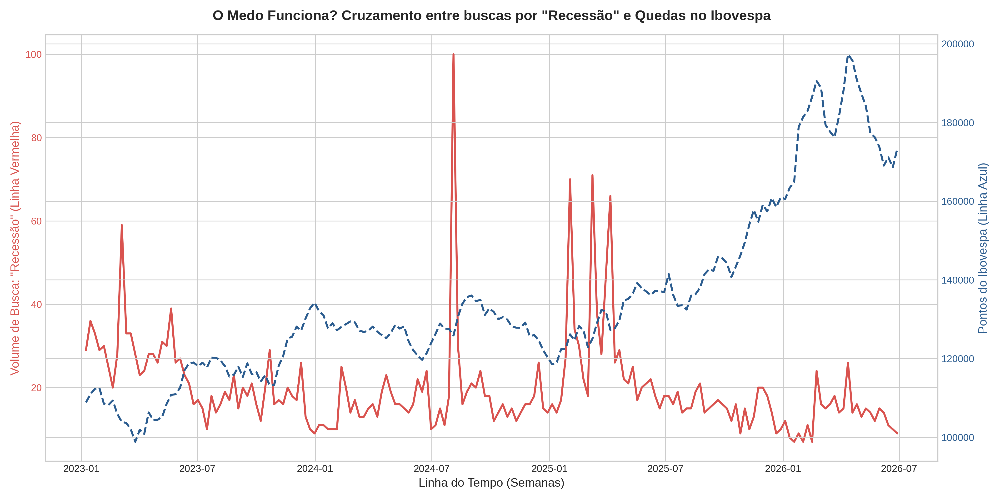

# Sentimento de Mercado, Atenção do Investidor e o Equity Risk Premium Implícito no Brasil

Este projeto cruza dados de psicologia comportamental da internet com a precificação de ativos reais no Brasil, utilizando o volume de buscas como um proxy para a atenção e o sentimento do investidor.

## Sentido do Gráfico
O gráfico utiliza **dois eixos verticais independentes** para correlacionar duas naturezas de dados perfeitamente sincronizadas no tempo:
1. **O Eixo Vermelho (Esquerda):** Mensura o nível de preocupação macroeconômica do público geral através do *Search Volume Index* (SVI) para o termo "Recessão".
2. **O Eixo Azul (Direita):** Mostra o comportamento do mercado de capitais real por meio do preço de fechamento semanal do **Índice Ibovespa**.

**O Insight Prático:** Em mercados eficientes, as informações deveriam ser precificadas instantaneamente. No entanto, através das Finanças Comportamentais, avaliamos se surtos de atenção na internet (picos no eixo vermelho) funcionam como um **termômetro de pânico** capaz de anteceder ou coincidir com pressões vendedoras e quedas no mercado de ações (eixo azul), afetando diretamente o prêmio de risco exigido pelos investidores (*Equity Risk Premium*).

---

## Justificativa Teórica

### 1. A Hipótese da Atenção Limitada
De acordo com a teoria econômica comportamental, os agentes possuem atenção e capacidade de processamento de informações limitadas. Portanto, o comportamento de busca na internet não é apenas ruído; é a manifestação direta e quantificável de para onde a atenção do mercado está migrando. Quando o investidor de varejo ou o público geral foca excessivamente em termos de crise, o sentimento de aversão ao risco se eleva.

### 2. Dados Alternativos (Alternative Data) em Finanças Quantitativas
O uso de dados tradicionais (balanços, DREs, relatórios oficiais) já está saturado e precificado pelos algoritmos de alta frequência. O uso do Google Trends se enquadra na categoria de **dados alternativos**, fornecendo uma vantagem informacional ao capturar o humor e a psicologia de massa antes que ela se reflita completamente nos dados macroeconômicos defasados (como relatórios trimestrais ou mensais de inflação/PIB).

---

## 📚 Referências Teóricas Fundamentais

Para embasar a metodologia e a interpretação dos resultados deste projeto, foram utilizadas as seguintes referências da literatura de finanças e psicologia:

1. **Da, Z., Engelberg, J., & Gao, P. (2011). *In Search of Attention*. The Journal of Finance, 66(5), 1461-1499.**
   - *Este é o artigo seminal que provou cientificamente que o volume de buscas no Google (SVI) é uma medida direta e robusta da atenção do investidor e que ela antecipa movimentos de preços de curto prazo.*
   
2. **Kahneman, D. (1973). *Attention and Effort*. Prentice-Hall.**
   - *Base psicológica do projeto: estabelece que a atenção humana é um recurso escasso e limitado, fundamentando por que o foco em termos de risco (como "Recessão") molda a tomada de decisão econômica.*
   
3. **Preis, T., Moat, H. S., & Stanley, H. E. (2013). *Quantifying Trading Behavior in Financial Markets Using Google Trends*. Scientific Reports, 3(1), 1-6.**
   - *Provou que estratégias de trading baseadas no volume de buscas de termos financeiros no Google podem superar significativamente o desempenho de estratégias tradicionais de 'buy-and-hold'.*

- ## 🛠️ Tecnologias Utilizadas
- **Python 3**
- **Pytrends API** (Extração de dados do Google Trends)
- **Yahoo Finance API (`yfinance`)** (Coleta de dados reais de mercado)
- **Pandas & Matplotlib** (Tratamento de séries temporais e visualização técnica)

## 📈 Resultados Obtidos
Abaixo está o gráfico gerado automaticamente pelo algoritmo, cruzando o volume de buscas de termos cruciais com os momentos de estresse do mercado brasileiro:

## 🧠 Competências Demonstradas
- Manipulação de dados estruturados e de séries temporais (*time series analysis*).
- Integração de APIs não oficiais e sincronização de janelas temporais de fontes distintas (Dados Semanais vs Diários).
- Plotagem gráfica com rigor analítico e marcações de eventos reais.
